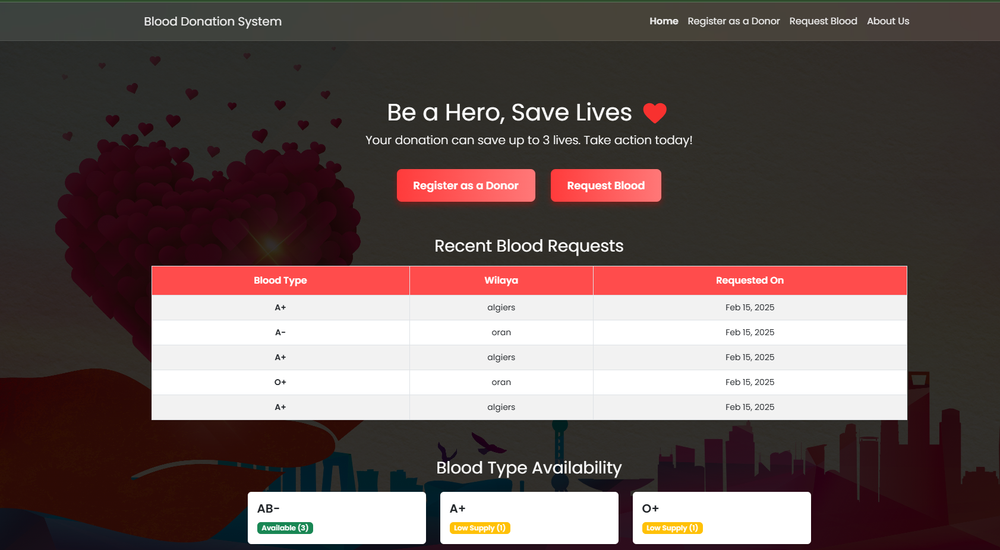
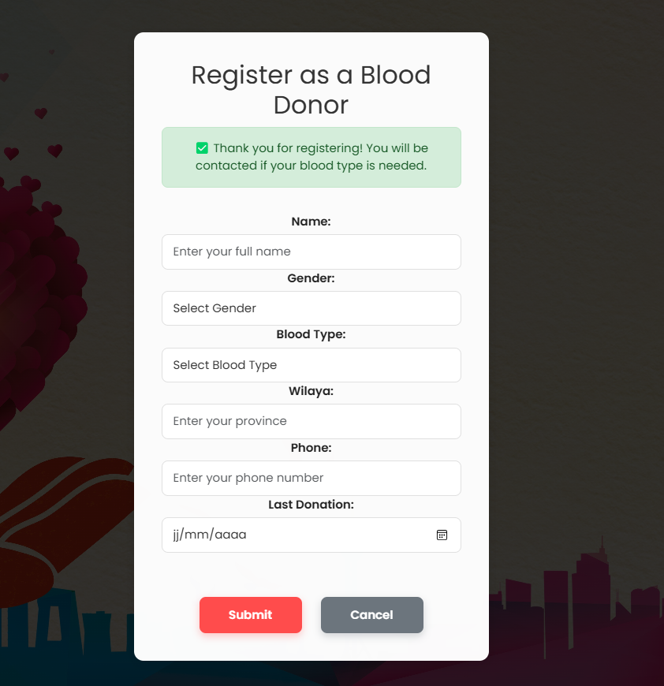
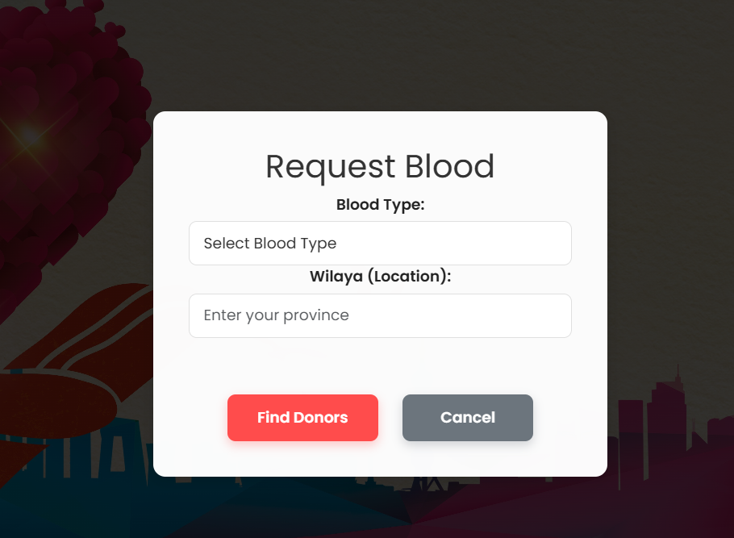

# 🩸 BloodLink

A life-saving web platform connecting blood donors with those in urgent need. 
Fast, efficient, and community-driven. Donate blood, save lives! 🩸❤️

---

## 📌 Features
✅ Register as a blood donor  
✅ Request blood from available donors  
✅ Search for donors by **blood type** and **location**  
✅ Secure and user-friendly interface  

---

## 🚀 Installation Guide
### Prerequisites:
- Python 3.x
- Django
- Git

### Steps:
1️⃣ Clone the repository:
```sh
git clone https://github.com/tuba89/BloodLink.git

## 🚀 Technologies Used
This project is built with:
- Django (Python)
- Bootstrap (CSS)
- SQLite (Database)
- Git & GitHub (Version Control)

## 🖼 Screenshots
### Home Page
 

### Donor Registration Page


### Donor Request blood Page


## 🤝 Contributing
Want to improve **BloodLink**? Contributions are welcome!
1. **Fork** the repository
2. **Create a new branch**: `git checkout -b feature-name`
3. **Make your changes and commit**: `git commit -m "Added new feature"`
4. **Push to GitHub**: `git push origin feature-name`
5. **Open a Pull Request** 🛠️

## 🌍 Future Improvements
🔹 Email/SMS notifications for urgent requests  
🔹 Admin panel for hospitals and blood banks  
🔹 Support for multiple languages  

## 📧 Contact
Have questions or suggestions? Reach out!  
📩 Email: `iiiassia.beniii@gmail.com`  
🔗 GitHub: [tuba89](https://github.com/tuba89)

